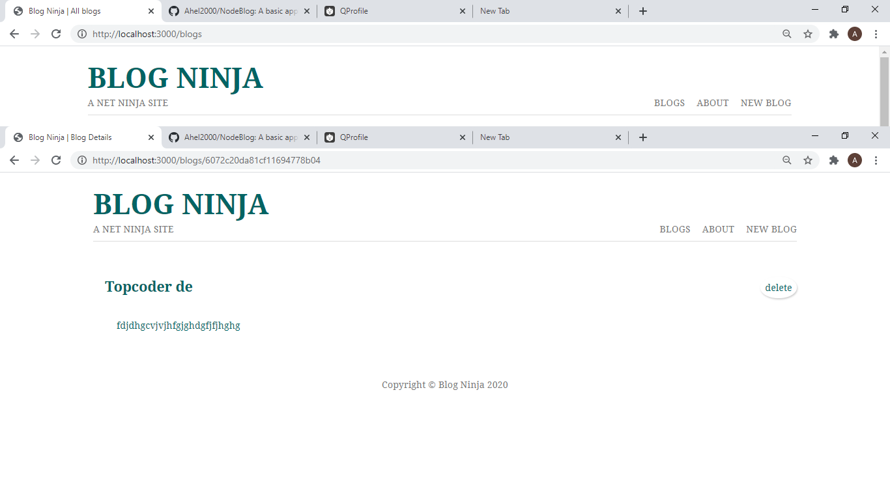

# A SIMPLE BLOG

This is my first project in NodeJs. The blog supports three basic CRUD operations: insert, delete and fetch. It uses NodeJs for the backend and MongoDb as the database. I have built this site following a tutorial in a channel called Net Ninja on YouTube.

